<div align="center">

<!-- Animated Header -->


<!-- Typing Animation -->
<p align="center">
  <a href="https://git.io/typing-svg"></a>
</p>

<!-- Animated Badges -->
<p align="center">
  
  
  
</p>

<!-- Social Links with Animation -->
<p align="center">
  <a href="https://www.linkedin.com/in/muntasirmamun7/">
    
  </a>
  <a href="mailto:munmamun9@gmail.com">
    
  </a>
  <a href="https://medium.com/@muntasirmamun7">
    
  </a>
  <a href="https://muntasir-mamun7.github.io/Portfolio-Muntasir-2.0/">
    
  </a>
</p>

</div>

<br/>

<!-- About Me Section with Gradient -->


## 👨‍💻 About Me

```typescript
const muntasir = {
    fullName: "Muntasir Al Mamun",
    pronouns: "He/Him",
    location: "🌍 Earth",
    currentFocus: "Blockchain & Web3",
    passion: [
        "Building decentralized applications 🔗",
        "Smart contract security 🔒",
        "Solving complex problems 🧩",
        "Learning new technologies 📚"
    ],
    currentlyWorking: "Blockchain Framework for Spectrum Sharing",
    goal2024: "Master DeFi protocols & contribute to Web3 ecosystem",
    funFact: "I debug with console.log and I'm not ashamed! 😄"
};
```

### 🔥 What Drives Me

I'm a **passionate software developer** with a deep fascination for **blockchain technology** and the **decentralized web**. My journey in tech is fueled by curiosity and a desire to create innovative solutions that make a real impact.

🎯 **Current Mission:** Building blockchain-based frameworks for aerial network spectrum sharing  
🌟 **Vision:** Bridge traditional software development with cutting-edge Web3 technologies  
💡 **Approach:** Clean code, security-first mindset, and continuous learning

<br clear="right"/>

---

## 🚀 What I Do

<table>
<tr>
  <td width="50%">
    
### 🔗 Blockchain Development
- ⚡ Smart Contracts on Ethereum
- 🏗️ Decentralized Applications (dApps)
- 🔐 Security Auditing & Best Practices
- 💎 DeFi Protocol Integration
  
  </td>
  <td width="50%">
    
### 💻 Software Engineering
- 🛠️ Full-stack Development
- 🎮 Game Development with Unity
- 🔧 Backend Systems & APIs
- 📱 Modern Web Technologies
    
  </td>
</tr>
<tr>
  <td width="50%">
    
### 🔬 Research & Innovation
- 🌐 Distributed Systems
- 📡 Blockchain in Aerial Networks
- 🧪 Emerging Web3 Technologies
- 📊 Data Structures & Algorithms
    
  </td>
  <td width="50%">
    
### ✍️ Content Creation
- 📝 Technical Writing on [Medium](https://medium.com/@muntasirmamun7)
- 🎓 Sharing Knowledge & Tutorials
- 💬 Community Engagement
- 🎤 Speaking about Blockchain
    
  </td>
</tr>
</table>

---

## 🛠️ Technology Stack

<div align="center">

### Languages & Frameworks
<p>
  
  
  
  
  
  
  
  
  
</p>

### Blockchain & Web3
<p>
  
  
  
  
  
</p>

### Tools & Technologies
<p>
  
  
  
  
  
  
  
</p>

</div>

---

## 📊 GitHub Statistics

<div align="center">
  
  
</div>

<div align="center">
  
  
</div>

---

## 📈 Contribution Activity

<div align="center">
  
</div>

---

## 🐍 Contribution Snake

<div align="center">
  <picture>
    <source media="(prefers-color-scheme: dark)" srcset="https://raw.githubusercontent.com/Muntasir-Mamun7/Muntasir-Mamun7/output/github-contribution-grid-snake-dark.svg">
    <source media="(prefers-color-scheme: light)" srcset="https://raw.githubusercontent.com/Muntasir-Mamun7/Muntasir-Mamun7/output/github-contribution-grid-snake.svg">
    
  </picture>
</div>

---

## 🎨 GitHub Contribution Art

<div align="center">
  
</div>

---

## 🏆 GitHub Achievements

<div align="center">
  
</div>

---

## 💼 Featured Projects

<div align="center">

[](https://github.com/Muntasir-Mamun7/SmartContract-tweet-add-event)

</div>

---

## 📚 Latest Blog Posts

<!-- BLOG-POST-LIST:START -->
- Stay tuned for exciting blockchain & Web3 content!
<!-- BLOG-POST-LIST:END -->

➡️ [Read more on Medium](https://medium.com/@muntasirmamun7)

---

## 🎯 Current Goals

```javascript
const goals2024 = {
    learning: ["Advanced DeFi Protocols", "Zero-Knowledge Proofs", "Layer 2 Solutions"],
    building: ["Decentralized Exchange", "NFT Marketplace", "DAO Platform"],
    contributing: ["Open Source Web3 Projects", "Blockchain Security Tools"],
    sharing: ["Technical Blogs", "Tutorial Videos", "Conference Talks"]
};
```

---

## 💬 Let's Connect!

<div align="center">

### 🌟 Open to collaborating on innovative blockchain projects! 🌟

<p>
  <a href="https://www.linkedin.com/in/muntasirmamun7/">
    
  </a>
  <a href="mailto:munmamun9@gmail.com">
    
  </a>
  <a href="https://muntasir-mamun7.github.io/Portfolio-Muntasir-2.0/">
    
  </a>
</p>

<br/>

**💡 "Innovation distinguishes between a leader and a follower." - Steve Jobs**

<br/>

</div>

<!-- Footer Wave -->

