<!--  -->

  

<!--
  
-->

- 🔭 I’m currently working on [G3 Architect](https://muntasir-mamun7.github.io/g3-arch/)

- 🌱 I’m currently learning **DeepLearning.AI & Java Spring Boot**

- 👨‍💻 All of my projects are available at [https://muntasir-mamun7.github.io/Portfolio-Muntasir-2.0/](https://muntasir-mamun7.github.io/Portfolio-Muntasir-2.0/)

- 📝 I regularly write articles on [https://medium.com/@muntasirmamun7](https://medium.com/@muntasirmamun7)

- 📫 How to reach me **munmamun9@gmail.com**

- 📄 Know about my experiences [https://muntasir-mamun7.github.io/Portfolio-Muntasir-2.0/muntasir-resume.pdf](https://muntasir-mamun7.github.io/Portfolio-Muntasir-2.0/Muntasir-mamun-resume.pdf)

<h3 align="center">Languages and Tools:</h3>

    
    
    
    
    
    
    
    
    
    

  
  

  

## JAVA Projects

  

  
  

